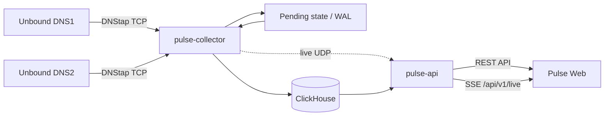
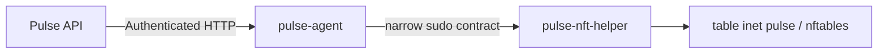

# Pulse
### DNS Observability Platform

Pulse — self-hosted DNS observability platform для Unbound, использующая
DNStap, ClickHouse и realtime Web UI.

## Возможности

- приём DNStap-телеметрии от нескольких DNS-резолверов;
- обработка `CLIENT_QUERY` и `CLIENT_RESPONSE`;
- корреляция запросов и ответов с исходами `RESPONSE`, `NO_RESPONSE` и
  `UNMATCHED_RESPONSE`;
- QPS, NXDOMAIN, SERVFAIL, распределение RCODE и P50/P95 latency;
- Resolver Comparison, состояние источников и freshness/ingest lag;
- Live Traffic через Server-Sent Events (SSE);
- cursor-based Search по DNS-событиям;
- представления Clients, Domains, Sources и Pipeline;
- простые operational Anomalies на основе текущих порогов;
- Admin-аутентификация, серверные сессии, rate limiting и CSRF-защита;
- шаблоны HTTPS-развёртывания через nginx;
- опциональный multi-node DNS control-plane для Block/Unblock.

## Архитектура



Опциональный control-plane:



Control-plane не требуется для DNS monitoring. Он развёртывается отдельно и
может быть полностью отключён через конфигурацию узлов.

Pulse и DNStap не находятся в critical DNS request path. Недоступность Pulse не
должна останавливать DNS resolution в Unbound; в этот период теряется или
становится неполной observability-телеметрия.

## Как обрабатывается DNS-событие

1. Unbound отправляет DNStap `CLIENT_QUERY` и `CLIENT_RESPONSE` по TCP.
2. `pulse-collector` нормализует source identity, client IP, transport, DNS ID,
   QNAME, QTYPE и RCODE.
3. Запрос помещается в pending correlation state. Состояние зеркалируется в
   локальный WAL и периодические checkpoints.
4. Ответ сопоставляется с запросом по source, client IP/port, protocol, DNS ID,
   QNAME и QTYPE. Если ответ не появился до correlation timeout, формируется
   `NO_RESPONSE`; ответ без pending-запроса становится `UNMATCHED_RESPONSE`.
5. Для сопоставленного `RESPONSE` latency вычисляется как разница между
   DNStap `response_time` и `query_time` и хранится в микросекундах. Это время
   между событиями Unbound для клиентского запроса и клиентского ответа, а не
   отдельно измеренный network RTT. Для `NO_RESPONSE` и
   `UNMATCHED_RESPONSE` latency отсутствует.
6. Нормализованная транзакция записывается в ClickHouse. Materialized views
   поддерживают минутные и часовые агрегаты для API.
7. `pulse-api` читает агрегаты для REST-запросов и публикует best-effort live
   поток через SSE. Web UI не загружает raw dataset для Overview.

Подробные outcome-инварианты описаны в
[transaction-semantics.md](src/docs/transaction-semantics.md).

## Компоненты

- **pulse-collector** — DNStap TCP intake, query/response correlation,
  pending WAL/checkpoint, ClickHouse writer и live publisher.
- **pulse-api** — authenticated REST API, SSE, operational status и
  опциональный central control-plane.
- **Pulse Web** — React/TypeScript SPA для наблюдения и расследований.
- **ClickHouse** — хранение raw DNS-транзакций и агрегатов. Текущая схема
  задаёт 24-часовой TTL для raw events, DNS-агрегатов и client/domain
  last-seen; `source_last_seen` и `schema_migrations` этим TTL не ограничены.
- **pulse-agent** — непривилегированный агент управления DNS-доступом на DNS
  node; хранит desired state и audit log.
- **pulse-nft-helper** — минимальный root-owned helper, управляющий только
  `table inet pulse`.

## Структура репозитория

```text
.
├── compose.yaml            # Pulse Core Docker Compose
├── install.sh              # idempotent one-command installer
├── Makefile                # operational shortcuts
├── docker/                 # image, nginx and ClickHouse definitions
├── scripts/                # doctor, backup, restore and upgrade
├── README.md
├── src/
│   ├── cmd/                 # Go services and helpers
│   ├── db/                  # ClickHouse schema and migrations
│   ├── deploy/              # systemd, env and agent bundle templates
│   ├── docs/                # Backend/control-plane documentation
│   ├── go.mod
│   └── go.sum
└── web/
    ├── deploy/              # nginx templates
    ├── src/                 # React application
    ├── tests/               # Playwright UI and integration E2E
    ├── package.json
    └── package-lock.json
```

Каталог `bin/` используется локальным deployment и намеренно исключён из Git.

## Docker Quick Start

Pulse Core не требует установки агента на DNS-резолверы. Docker deployment
поднимает только ClickHouse, `pulse-collector`, `pulse-api` и Pulse Web. После
установки достаточно направить DNStap из Unbound на опубликованный TCP-порт
collector.

На чистой поддерживаемой Ubuntu-машине с Docker Engine и Docker Compose v2:

```bash
git clone <PULSE_REPOSITORY_URL> pulse
cd pulse
sudo ./install.sh
```

Installer проверяет ОС, архитектуру, Docker, свободное место и host ports;
создаёт `.env` с mode `0600`, генерирует независимые ClickHouse credentials и
self-signed TLS certificate, собирает образы, применяет схему, запрашивает
первый Admin password и выполняет health/smoke checks. Повторный запуск
идемпотентен: существующие secrets, Admin state и данные не пересоздаются.
При запуске через `sudo` project-local `.env` и `.docker/tls` принадлежат
исходному `SUDO_USER` с ограниченными permissions. Поэтому operator с доступом
к Docker daemon выполняет `docker compose`, `make` и scripts без `sudo`.

Сертификат первой установки является self-signed. Его можно добавить в
локальное trust store либо заменить своими certificate/key через
`PULSE_TLS_CERT_FILE` и `PULSE_TLS_KEY_FILE`. Let's Encrypt в этот deployment
не встроен; внешний reverse proxy можно добавить отдельно.

### Configuration

Defaults находятся в `.env.example`. Для нестандартной установки создайте
`.env` заранее и измените только необходимые параметры:

```bash
cp .env.example .env
chmod 600 .env
editor .env
sudo ./install.sh
```

Основные параметры:

| Variable | Default | Назначение |
|---|---:|---|
| `PULSE_BIND_ADDRESS` | `0.0.0.0` | адрес host для Web и DNStap |
| `PULSE_WEB_PORT` | `443` | внешний HTTPS-порт |
| `PULSE_DNSTAP_PORT` | `6000` | внешний DNStap TCP-порт |
| `PULSE_PUBLIC_NAME` | `pulse` | DNS SAN/CN для self-signed certificate |
| `PULSE_EXPECTED_SOURCES` | empty | необязательный список ожидаемых source identities |
| `PULSE_ADMIN_USERNAME` | `admin` | имя первого Admin |

Значения `GENERATE_ON_INSTALL` заменяются случайными secrets только при первой
установке. Реальный `.env`, TLS key и runtime state исключены из Git.

### Ports and network

Наружу публикуются только:

- HTTPS Web/API: `${PULSE_BIND_ADDRESS}:${PULSE_WEB_PORT}`;
- DNStap: `${PULSE_BIND_ADDRESS}:${PULSE_DNSTAP_PORT}/tcp`.

`pulse-api:8081`, ClickHouse `8123/9000`, collector status `9093` и live UDP
`9092` доступны только в отдельной Docker bridge network. Compose не использует
host networking и privileged containers.

Пример Unbound использует placeholders и только client query/response events:

```yaml
dnstap:
    dnstap-enable: yes
    dnstap-bidirectional: yes
    dnstap-ip: "<PULSE_IP>@<PULSE_DNSTAP_PORT>"
    dnstap-tls: no
    dnstap-send-identity: yes
    dnstap-identity: "resolver-a"
    dnstap-log-client-query-messages: yes
    dnstap-log-client-response-messages: yes
```

### Persistent volumes

- `clickhouse-data` — raw DNS telemetry, aggregates, schema и migration history;
- `collector-state` — pending WAL, checkpoints и recovery marker;
- `api-state` — Admin accounts/password hashes и API runtime state.

Обычные `docker compose down` / `up -d` сохраняют эти данные.

### Operations

```bash
make status
make logs
make doctor
make backup
make upgrade
```

`scripts/doctor.sh` выполняет read-only проверку daemon/Compose, network,
volumes, container health, ClickHouse/API/collector/Web endpoints, published
ports и отсутствие accidental exposure API/ClickHouse.

Backup ClickHouse выполняется штатным `BACKUP DATABASE`, а не копированием
работающего data directory:

```bash
./scripts/backup.sh
./scripts/backup.sh --include-secrets  # explicit sensitive archive mode
```

По умолчанию portable archive не содержит `.env` и API password hashes.
`--include-secrets` добавляет их с явным предупреждением; такой archive нужно
хранить как secret.

Restore требует manifest, compatibility check и явное подтверждение:

```bash
./scripts/restore.sh --backup backups/pulse-<TIMESTAMP>.tar.gz
./scripts/restore.sh --backup backups/pulse-<TIMESTAMP>.tar.gz --restore-auth-state
```

Restore работает только с volumes текущего Docker Compose project и не
обращается к native ClickHouse или systemd services host.

Upgrade выполняет `doctor → backup → pull/build → migrations → recreate →
health validation`:

```bash
./scripts/upgrade.sh
```

### Troubleshooting and uninstall

```bash
docker compose ps
docker compose logs --tail=200
./scripts/doctor.sh
docker compose config
```

Остановить и удалить containers/network, сохранив данные:

```bash
docker compose down
```

**Не запускайте `docker compose down -v`, если вы не намерены безвозвратно
удалить данные после проверенного backup.** Флаг `-v` удаляет ClickHouse,
collector WAL и Admin state volumes.

Optional `pulse-agent`/DNS Control не входит в Docker Core, не устанавливается
`install.sh` и документируется отдельно.

## Требования

Фактические требования, закреплённые в репозитории:

- Go 1.22;
- Node.js 20 или новее для полного frontend/E2E toolchain (Playwright 1.63.0
  требует Node.js `>=20`);
- npm и зависимости из `web/package-lock.json`;
- ClickHouse с поддержкой используемых MergeTree/AggregatingMergeTree,
  materialized views и TDigest aggregate states; Docker deployment закреплён
  на версии `26.3.36.6`, native deployment управляется отдельно;
- Unbound, собранный с DNStap support; версия Unbound не закреплена;
- Linux для production templates; systemd и nginx для показанного deployment;
- Docker Engine и Docker Compose v2 для one-command Docker deployment;
- для опционального control-plane: nftables, sudo, `ip`, `ss`, curl и
  sha256sum.

## Unbound / DNStap

Базовый пример отправляет только client query/response messages:

```yaml
dnstap:
    dnstap-enable: yes
    dnstap-bidirectional: yes
    dnstap-ip: "<PULSE_IP>@6000"
    dnstap-tls: no
    dnstap-send-identity: yes
    dnstap-identity: "dns1"
    dnstap-log-client-query-messages: yes
    dnstap-log-client-response-messages: yes
```

`dnstap-identity` должен быть уникальным и совпадать с source identity в Pulse.
Resolver/forwarder events не требуются для текущей модели транзакций.

## Web UI

- **Overview** — operational KPI, QPS и error/latency timeline, RCODE,
  freshness, top clients/domains и operational signals.
- **Resolver Comparison** — компактное сравнение источников по realtime QPS,
  NXDOMAIN, SERVFAIL, P95 latency, health, last seen и traffic share.
- **Live Traffic** — фильтруемый realtime SSE-поток.
- **Search** — cursor-based поиск raw событий в пределах retention.
- **Clients** и **Domains** — списки и inspectors с агрегатами, timeline и
  связанными сущностями.
- **Anomalies** — текущие threshold-based operational conditions.
- **Sources** — telemetry connection/state и, при наличии, agent/control
  health.
- **Pipeline** — состояние durable ingest, WAL, live delivery, ClickHouse и
  control nodes.
- **Settings** — runtime capabilities, retention metadata и управление Admin
  accounts.

Поддерживаемые диапазоны UI: `15m`, `1h`, `3h`, `6h`, `12h`, `24h`.

## Security

- публикуйте Web UI только через HTTPS;
- ограничивайте доступ management-сетью или отдельным reverse proxy policy;
- Pulse использует Argon2id password hashes и server-side sessions;
- session cookie имеет `Secure`, `HttpOnly` и `SameSite=Strict`;
- mutating API требует CSRF token;
- secrets, bearer tokens, runtime state, private keys и production certificates
  должны находиться вне Git;
- не публикуйте ClickHouse и localhost status/API endpoints наружу без
  необходимости;
- выдавайте API и ClickHouse users только минимально необходимые права;
- control-plane отделён от observability path: `pulse-agent` работает без root
  и capabilities, а root helper ограничен отдельной nftables table.

Адреса в deploy-файлах используют documentation networks RFC 5737. Перед
установкой их необходимо заменить значениями конкретного окружения и проверить
конфигурацию штатными валидаторами.

## Development

Backend:

```bash
cd src
go test ./...
go vet ./...
```

Frontend:

```bash
cd web
npm ci
npm run lint
npm run build
```

Полный E2E запускается против доступного HTTPS deployment. Harness запрашивает
Admin username и password интерактивно; пароль вводится без echo. В CI используйте
секреты `PULSE_E2E_USERNAME` и `PULSE_E2E_PASSWORD` и при необходимости задайте
`PLAYWRIGHT_BASE_URL`:

```bash
cd web
npm run test:e2e
```

## Documentation

- [DNS transaction semantics](src/docs/transaction-semantics.md)
- [Pending transaction persistence](src/docs/pending-persistence.md)
- [Investigation API contracts](src/docs/investigation-api.md)
- [pulse-agent control plane](src/docs/pulse-agent.md)
- [pulse-agent bundle installer](src/docs/pulse-agent-install.md)

## Project status

Pulse активно развивается.

---
by.Bezhan
