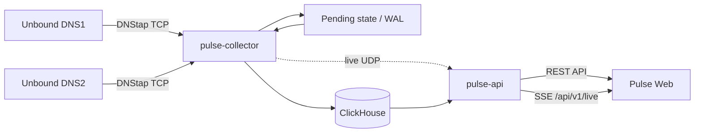
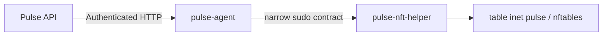

# Pulse
### DNS Observability Platform

Pulse — self-hosted DNS observability platform для Unbound, использующая
DNStap, ClickHouse и realtime Web UI.

## Возможности

- приём DNStap-телеметрии от нескольких DNS-резолверов;
- обработка `CLIENT_QUERY` и `CLIENT_RESPONSE`;
- корреляция запросов и ответов с исходами `RESPONSE`, `NO_RESPONSE` и
  `UNMATCHED_RESPONSE`;
- QPS, NXDOMAIN, SERVFAIL, распределение RCODE и P50/P95 latency;
- Resolver Comparison, состояние источников и freshness/ingest lag;
- Live Traffic через Server-Sent Events (SSE);
- cursor-based Search по DNS-событиям;
- представления Clients, Domains, Sources и Pipeline;
- простые operational Anomalies на основе текущих порогов;
- Admin-аутентификация, серверные сессии, rate limiting и CSRF-защита;
- шаблоны HTTPS-развёртывания через nginx;
- опциональный multi-node DNS control-plane для Block/Unblock.

## Архитектура



Опциональный control-plane:



Control-plane не требуется для DNS monitoring. Он развёртывается отдельно и
может быть полностью отключён через конфигурацию узлов.

Pulse и DNStap не находятся в critical DNS request path. Недоступность Pulse не
должна останавливать DNS resolution в Unbound; в этот период теряется или
становится неполной observability-телеметрия.

## Как обрабатывается DNS-событие

1. Unbound отправляет DNStap `CLIENT_QUERY` и `CLIENT_RESPONSE` по TCP.
2. `pulse-collector` нормализует source identity, client IP, transport, DNS ID,
   QNAME, QTYPE и RCODE.
3. Запрос помещается в pending correlation state. Состояние зеркалируется в
   локальный WAL и периодические checkpoints.
4. Ответ сопоставляется с запросом по source, client IP/port, protocol, DNS ID,
   QNAME и QTYPE. Если ответ не появился до correlation timeout, формируется
   `NO_RESPONSE`; ответ без pending-запроса становится `UNMATCHED_RESPONSE`.
5. Для сопоставленного `RESPONSE` latency вычисляется как разница между
   DNStap `response_time` и `query_time` и хранится в микросекундах. Это время
   между событиями Unbound для клиентского запроса и клиентского ответа, а не
   отдельно измеренный network RTT. Для `NO_RESPONSE` и
   `UNMATCHED_RESPONSE` latency отсутствует.
6. Нормализованная транзакция записывается в ClickHouse. Materialized views
   поддерживают минутные и часовые агрегаты для API.
7. `pulse-api` читает агрегаты для REST-запросов и публикует best-effort live
   поток через SSE. Web UI не загружает raw dataset для Overview.

Подробные outcome-инварианты описаны в
[transaction-semantics.md](src/docs/transaction-semantics.md).

## Компоненты

- **pulse-collector** — DNStap TCP intake, query/response correlation,
  pending WAL/checkpoint, ClickHouse writer и live publisher.
- **pulse-api** — authenticated REST API, SSE, operational status и
  опциональный central control-plane.
- **Pulse Web** — React/TypeScript SPA для наблюдения и расследований.
- **ClickHouse** — хранение raw DNS-транзакций и агрегатов. Текущая схема
  задаёт 24-часовой TTL для raw events, DNS-агрегатов и client/domain
  last-seen; `source_last_seen` и `schema_migrations` этим TTL не ограничены.
- **pulse-agent** — непривилегированный агент управления DNS-доступом на DNS
  node; хранит desired state и audit log.
- **pulse-nft-helper** — минимальный root-owned helper, управляющий только
  `table inet pulse`.

## Структура репозитория

```text
.
├── README.md
├── src/
│   ├── cmd/                 # Go services and helpers
│   ├── db/                  # ClickHouse schema and migrations
│   ├── deploy/              # systemd, env and agent bundle templates
│   ├── docs/                # Backend/control-plane documentation
│   ├── go.mod
│   └── go.sum
└── web/
    ├── deploy/              # nginx templates
    ├── src/                 # React application
    ├── tests/               # Playwright UI and integration E2E
    ├── package.json
    └── package-lock.json
```

Каталог `bin/` используется локальным deployment и намеренно исключён из Git.

## Требования

Фактические требования, закреплённые в репозитории:

- Go 1.22;
- Node.js 20 или новее для полного frontend/E2E toolchain (Playwright 1.63.0
  требует Node.js `>=20`);
- npm и зависимости из `web/package-lock.json`;
- ClickHouse с поддержкой используемых MergeTree/AggregatingMergeTree,
  materialized views и TDigest aggregate states; версия сервера в репозитории
  не закреплена;
- Unbound, собранный с DNStap support; версия Unbound не закреплена;
- Linux для production templates; systemd и nginx для показанного deployment;
- для опционального control-plane: nftables, sudo, `ip`, `ss`, curl и
  sha256sum.

## Unbound / DNStap

Базовый пример отправляет только client query/response messages:

```yaml
dnstap:
    dnstap-enable: yes
    dnstap-bidirectional: yes
    dnstap-ip: "<PULSE_IP>@6000"
    dnstap-tls: no
    dnstap-send-identity: yes
    dnstap-identity: "dns1"
    dnstap-log-client-query-messages: yes
    dnstap-log-client-response-messages: yes
```

`dnstap-identity` должен быть уникальным и совпадать с source identity в Pulse.
Resolver/forwarder events не требуются для текущей модели транзакций.

## Web UI

- **Overview** — operational KPI, QPS и error/latency timeline, RCODE,
  freshness, top clients/domains и operational signals.
- **Resolver Comparison** — компактное сравнение источников по realtime QPS,
  NXDOMAIN, SERVFAIL, P95 latency, health, last seen и traffic share.
- **Live Traffic** — фильтруемый realtime SSE-поток.
- **Search** — cursor-based поиск raw событий в пределах retention.
- **Clients** и **Domains** — списки и inspectors с агрегатами, timeline и
  связанными сущностями.
- **Anomalies** — текущие threshold-based operational conditions.
- **Sources** — telemetry connection/state и, при наличии, agent/control
  health.
- **Pipeline** — состояние durable ingest, WAL, live delivery, ClickHouse и
  control nodes.
- **Settings** — runtime capabilities, retention metadata и управление Admin
  accounts.

Поддерживаемые диапазоны UI: `15m`, `1h`, `3h`, `6h`, `12h`, `24h`.

## Security

- публикуйте Web UI только через HTTPS;
- ограничивайте доступ management-сетью или отдельным reverse proxy policy;
- Pulse использует Argon2id password hashes и server-side sessions;
- session cookie имеет `Secure`, `HttpOnly` и `SameSite=Strict`;
- mutating API требует CSRF token;
- secrets, bearer tokens, runtime state, private keys и production certificates
  должны находиться вне Git;
- не публикуйте ClickHouse и localhost status/API endpoints наружу без
  необходимости;
- выдавайте API и ClickHouse users только минимально необходимые права;
- control-plane отделён от observability path: `pulse-agent` работает без root
  и capabilities, а root helper ограничен отдельной nftables table.

Адреса в deploy-файлах используют documentation networks RFC 5737. Перед
установкой их необходимо заменить значениями конкретного окружения и проверить
конфигурацию штатными валидаторами.

## Development

Backend:

```bash
cd src
go test ./...
go vet ./...
```

Frontend:

```bash
cd web
npm ci
npm run lint
npm run build
```

Полный E2E запускается против доступного HTTPS deployment. Harness запрашивает
Admin username и password интерактивно; пароль вводится без echo. В CI используйте
секреты `PULSE_E2E_USERNAME` и `PULSE_E2E_PASSWORD` и при необходимости задайте
`PLAYWRIGHT_BASE_URL`:

```bash
cd web
npm run test:e2e
```

## Documentation

- [DNS transaction semantics](src/docs/transaction-semantics.md)
- [Pending transaction persistence](src/docs/pending-persistence.md)
- [Investigation API contracts](src/docs/investigation-api.md)
- [pulse-agent control plane](src/docs/pulse-agent.md)
- [pulse-agent bundle installer](src/docs/pulse-agent-install.md)

## Project status

Pulse активно развивается.

---
by.Bezhan
